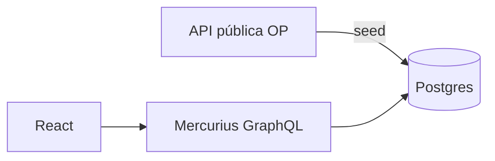

# Roadmap — 01 One Piece Wiki

| # | Fatia | Status | Done quando… |
|---|-------|--------|--------------|
| 0 | Skeleton `api/` + `web/` + GraphQL hello | ✅ | GraphiQL + React sobe |
| 1 | Prisma + model `Character` + seed (API pública OP) | ⬜ | dados no Postgres |
| 2 | Queries `characters` / `character(id)` | ⬜ | Nível 1 via GraphQL |
| 3 | Web: lista consumindo GraphQL | ⬜ | Nível 1 UI |
| 4 | Web: rota `/characters/:id` | ⬜ | Nível 2 |
| 5 | Tema One Piece + animações | ⬜ | Nível 3 |
| 6 | README afiado + (opcional) deploy | ⬜ | drill apresentável |

